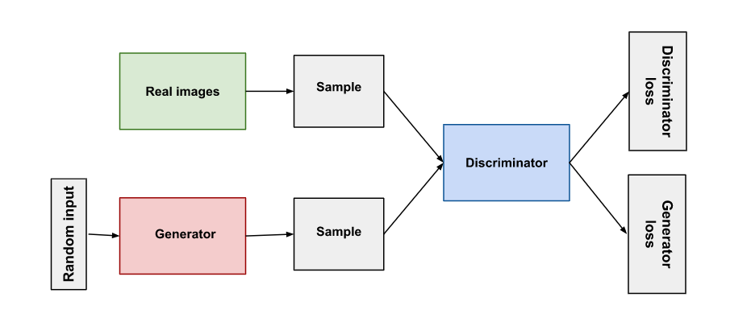

# Fake Anime Face Generation - DCGAN

## Objective 🎯

The objective of the project is to generate images of Anime faces using a Deep Convolutional GAN.
The DCGAN has two networks, the 'generator' and the 'discriminator'.
The generator takes in a random vector which then uses transposed convolutions to generate an image out of it.
The discriminator is a Convolutional network which then classifies whether an image is real or fake. It takes in samples of images from the dataset and also images generated by the generator.
Both networks try to improve each other's performance through backpropagation.

## Getting Started

- Use the command to clone this repository to your machine git clone `https://github.com/darthdaenerys/Anime-Face-Generation.git`
- Now change current directory to the folder `cd Anime-Face-Generation`
- `pip install -r requirements.txt`
- `python generator.py`

## Dataset

The dataset is taken from Kaggle over here. The data was obtained from [here](https://www.kaggle.com/datasets/splcher/animefacedataset). The dataset contains images of different sizes.

## Contributing

Contributions, issues and feature requests are welcome. After cloning & setting up project locally, you can just submit a PR to this repo and it will be deployed once it's accepted.

⚠️ It’s good to have descriptive commit messages, or PR titles so that other contributors can understand about your commit or the PR Created. Read conventional commits before making the commit message.

## Show your support

We love people's support in growing and improving. Be sure to leave a ⭐️ if you like the project and also be sure to contribute, if you're interested!
